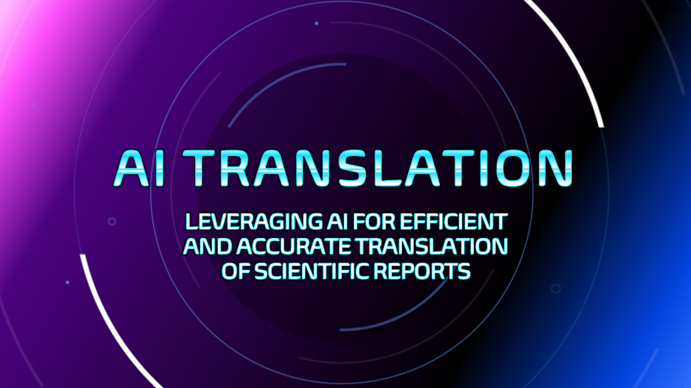

# AI TRANSLATION

### Leveraging AI for efficient and accurate translation of scientific reports



## Project Overview

### Objective

To create a finetuned AI translation model using official CSAS documents in
order to make the translation process faster, more accurate, and more
cost-effective.

### Project Description

The Canadian Science Advisory Secretariat (CSAS) publishes hundreds of
scientific documents each year, most of which require translation from English
to French under the Official Languages Act. This project involves fine-tuning an
AI translation model using ~10,000 existing CSAS translations. This could
improve consistency, accuracy, and significantly reduce translation costs and
timelines, ensuring faster delivery of scientific recommendations to Canadians.

Current translations are costly and time-consuming, with AI models often missing
scientific nuance, often leading to heavy manual edits. By leveraging our large
corpus of verified translations, we can train a model to handle context-specific
language far better than generic AI solutions. Implementation involves data
preparation, model training, and validation against existing translations and
standard AI tools.

**Key Benefits:**

- Faster translation turnaround
- Reduced translation costs
- Improved consistency in scientific terminology
- Better preservation of technical accuracy

### Project Outline

This proof-of-concept was developed through multiple phases:

- [Phase 1: Data Gathering and Transformation (complete)](https://github.com/KevinCarr42/AI-Translation)
- [Phase 2: Model Fine-Tuning (complete)](https://github.com/KevinCarr42/Translation-Fine-Tuning)
- [Phase 3: Rules-Based Preferential Translations (complete)](https://github.com/KevinCarr42/rule-based-translation)
- [Phase 4: Translation Quality Evaluation (complete)](https://github.com/KevinCarr42/CSAS-Translations)
- Phase 5: Integrated Translation System (in-progress)

## Phase 1: Data Gathering and Transformation

Data was obtained from the CSAS website for all posted documents. Published PDF
files generally include OCR-generated text of varying quality. Sentences were
matched between French and English where possible. Inaccurate or un-matched data
was excluded from the training data. In addition to OCR quality issues, a number
of challenges needed to be addressed in order to complete the data
transformation and create the training data set.

**Many older documents lack both French and English text**


**Published documents vary widely in length and quality**


**An advanced matching algorithm was created to correlate French and English**


## Phase 2: Model Fine-Tuning

The fine-tuning process involved selecting appropriate base models,
experimenting with different hyperparameters, and iteratively refining the
training approach based on translation quality results. Multiple model
configurations were tested to identify the most promising candidates for
scientific translation tasks.

**Model Fine-Tuning**

- Hyperparameter optimisation for translation quality
- Multiple model architecture testing
- Training performance evaluation
- Model selection based on scientific translation accuracy

This phase focused on fine-tuning AI translation models using the cleaned CSAS
translation data from Phase 1. During initial fine-tuning attempts, several data
quality issues emerged that required additional cleaning steps, including
missing punctuation, incomplete sentences, OCR errors, and non-words. These
issues were systematically identified and addressed to improve training data
quality.

**Data Cleaning and Re-Processing**

Following the initial finetuning, a number of translation quality issues were
noted. Using the finetuning issues, the data cleaning from the previous step was
improved and repeated. Issues discovered during initial fine-tuning included:

- Missing punctuation detection and filtering
- Incomplete sentence identification
- OCR error correction and filtering
- Non-word removal
- Data quality validation

**Fine-Tuning Outcomes**

This phase produced several fine-tuned translation models optimised for CSAS
scientific documents, with significantly improved data quality compared to the
initial Phase 1 dataset. The models demonstrated enhanced performance on
scientific terminology and context-specific translations.

## Phase 3: Rules-Based Preferential Translations

This phase implements a rule-based find-and-replace algorithm designed to work
in conjunction with the fine-tuned translation models from Phase 2. The system
preserves critical scientific terminology, location names, species names, and
acronyms that require consistent translation across CSAS documents, ensuring
accuracy and maintaining standardised terminology.

A significant challenge emerged in preventing translation models from modifying
the replacement tokens themselves. Through iterative testing and refinement, the
approach evolved from complex tokenisation schemes to a more robust word-based
system and fallback scheme.

### Rule-Based Translation System

- Find-and-replace algorithm for preserving critical terminology
- Key-value pair management for locations, species, acronyms, and scientific
  terms
- Error detection and fallback mechanism
- Integration layer with fine-tuned translation models

### Token Design Evolution

The token design underwent several iterations to prevent accidental translation:

- **Initial Approach**: Complex tokens like `__TECHNICAL_001__` proved
  problematic as models would translate components or remove special characters
- **Special Character Tokens**: Even unique characters like lozenges were
  affected by translation models
- **Encoder Integration**: Adding tokens directly to model encoders degraded
  translation quality
- **Final Solution**: Simple word-based tokens (`SITE0013`, `ACRONYM0001`,
  `NOMENCLATURE0008`, `TAXON0045`) chosen for language-neutral spelling

### Additional Fine-Tuning

An additional layer of fine-tuning was implemented and evaluated. However, this
was found to decrease the overall quality of the translations. Thus, additional
fine-tuning was not included in the final translation models.

### Challenges Addressed

- **Token Preservation**: Preventing translation models from modifying
  replacement tokens during translation
- **Model Integration**: Balancing rule-based interventions with neural
  translation quality
- **Error Handling**: Ensuring all tokens are properly accounted for before
  replacement
- **Terminology Consistency**: Maintaining standardised translations for
  scientific terms across documents

### Token Selection Strategy

- **SITE**: Identical spelling in English and French
- **NOMENCLATURE**: Identical spelling in both languages
- **TAXON**: Identical spelling in both languages
- **ACRONYM**: Commonly borrowed word in French, `ACRONYM0001` is unlikely to be
  translated to `ACRONYME0001`

### Error Prevention and Fallback Scheme

- Pre-replacement validation ensures all tokens are accounted for
- If token validation fails, translations are repeated under various
  configurations
- If all configurations fail token validation, the translation model uses a
  fallback of translation without token replacement

### Outcomes

In most cases, the rule-based system successfully preserves critical scientific
terminology while maintaining translation quality. In cases where the rule-based
system conflicts with the translation model, the models fallback defaults to the
translation without find and replace.

The system improves the consistency and accuracy of scientific translation.

## Phase 4: Translation Quality Evaluation

A comprehensive evaluation framework has been established to assess translation
quality through both analytical metrics and human evaluation surveys. This phase
focuses on optimising the integration between neural and rule-based components
while preparing for systematic quality assessment through blind survey
evaluation.

### Analytical Assessment

- Translation quality metrics and similarity calculations
- Comparison with baseline translation models
- Performance evaluation against previously published CSAS translations
- Technical accuracy assessment for scientific terminology

### Human Evaluation

A [translation quality survey application](https://github.com/KevinCarr42/translation-quality-survey-app/)
was developed to gather comparative
feedback on different model configurations. This helped inform final model
selection through blind evaluation of translation samples.

- Blind survey evaluation using randomised translation samples
- Quality ratings from domain experts and translation professionals
- Comparative ranking between different model configurations
- Statistical analysis of human evaluation results

## Phase 5: Integrated Translation System

This phase combines the fine-tuned translation models from Phase 2 with the
rule-based preferential translation system from Phase 3 to create the final
integrated translation solution. The combined system leverages both the
contextual understanding of fine-tuned models and the precision of rule-based
terminology preservation to deliver high-quality scientific translations.

### Features

- End-to-end translation pipeline for CSAS scientific documents
- Integration of neural and rule-based components
- Performance monitoring and quality metrics
- Support for multiple model configurations
- Ensemble model option for highest quality translations
- Microsoft Word document support with formatting preservation

### Best-of-Ensemble Combined Model

- In addition the individual translation models, another Best-of-Ensemble model
  is created by combining results from all other models
- For each sentence, the highest similarity between source and translated text
  (after excluding errors) is considered to be the Best-of-Ensemble or the
  "ensemble model"
- The ensemble model returns improved translations, while requiring more time
  and computational resources to complete translations

### Translation Pipeline

The pipeline processes documents through the following stages:

1. **Pre-processing:** Text extraction and sentence segmentation
2. **Tokenization:** Replace scientific terms with language-neutral tokens
3. **Translation:** Process through fine-tuned model(s)
4. **Token Replacement:** Restore preserved terminology with correct
   translations
5. **Validation:** Verify all tokens properly replaced
6. **Fallback:** If any tokens were not replaced properly, fall back to
   translating without find and replace
6. **Post-processing:** Format and return translated document

### Word Document Translation

The system supports translating Microsoft Word documents (.docx) while preserving formatting such as bold, italic, font sizes, colors, tables, and document structure.

**Usage Example:**

```python
from translate.document import translate_word_document
from translate.models import create_translator

# Create translation manager
translation_manager = create_translator(use_finetuned=True)

# Translate a Word document
translate_word_document(
    input_docx_file="path/to/input.docx",
    output_docx_file="path/to/output.docx",  # Optional: auto-generated if not specified
    source_lang="en",
    translation_manager=translation_manager
)
```

The translated document maintains the original formatting while translating the text content. Output files are automatically named with `_translated_{date}` suffix when no output path is specified.

## Other Considerations

### Environmental Impact

Given public concerns about the environmental impacts from AI systems, energy
consumption was evaluated. Assuming the most powerful ensemble model, and a
conservatively high 200 document translations yearly, each averaging of 12,000
words, the energy costs were shown to be insignificant:

- **Annual energy usage:** ~16 kWh
- **Annual energy cost:** ~$1.56
- **Reduction potential:** 90% energy savings using most efficient single
  model (with small quality trade-off)

These impacts are deemed to be negligible.

## Results and Conclusions

### Proof-of-concept Results

- AI translations are often superior to published translations
- Significant improvements in consistency for scientific terminology
- Substantial reduction in translation time and costs
- Quality continues to improve through iterative refinement

### Recommended Next Steps

- **Keep Local Initially:** Continue testing on server and local machines
  before broader deployment
- **Start ASAP:** Begin translating documents in parallel with normal workflow
  to gather real-world data
- **Track & Improve:** Document errors, effort required, and tasks for
  automation
- **Iterate:** Update data cleaning and fine-tuning based on production results

### Potential Future Enhancements

- Deployed web application
- Back-translation quality checker
- AI-powered proofreading with multiple strictness levels
- Translation comparison and validation tools
- Advanced UI with sentence-level model toggling
- Synthetic data for training preferred translations
